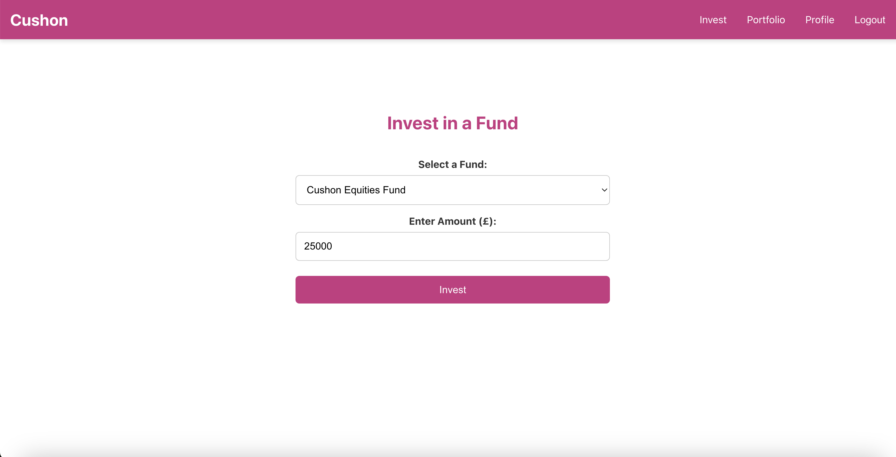

# Cushon ISA Application

## Overview

This project is a solution designed to allow retail (direct) customers to invest in the Cushon ISA. The system enables customers to select a fund from available options and specify the amount they wish to invest. The system records these details and allows users to query the information at a later time.

The project aims to provide a simple interface for retail customers to manage their investments in Cushon ISAs.

## Screenshots

1. **Home Page**  
   

2. **Register Page**  
   

3. **Login Page**  
   

4. **Home Page** - The buttons here change after logging in
   

5. **Invest Page**  
   

6. **Portfolio Page**  
   

7. **Profile Page**  
   

### Key Features

1. Fund Selection: Customers can select from a list of available funds (e.g., Cushon Ethical Fund, Cushon Equities Fund).
2. Amount Specification: Once a fund is selected, the customer can specify how much they would like to invest.
3. Record Keeping: The selected fund and investment amount are stored in the system for future retrieval.
4. Data Querying: Customers can query their investment details at any time.
5. User Authentication: Users must be logged in to make an investment or query their records. The system uses JWT for authentication.

### Tech Stack

- Frontend: React (with TypeScript)
- Backend: Python (Flask)
- Database: SQLite

### Database Schema

The database consists of two main tables:

- Users: Stores user information (e.g., ID, username, password).
- Investment History: Stores investment details, including:
  - User ID (foreign key referencing Users)
  - Fund Name (the fund selected by the user)
  - Investment Amount (the amount the user wants to invest)
  - Timestamp (when the investment was made)

### User Stories

- As a customer, I can select a fund from a list of available options.
- As a customer, I can specify how much money I want to invest.
- As a customer, I can view my previous investments.

## Setup Instructions

### Prerequisites

- Node.js (for the frontend)
- Python 3 (for the backend)
- SQLite (for the database)

### Installation

Clone the repository:
`git clone https://github.com/shafiul23/cushon-invest.git`

#### Frontend Setup:

Navigate to the frontend directory:
`cd client`

Install dependencies:
`npm install`

Start the frontend development server:
`npm start`

#### Backend Setup:

Navigate to the backend directory:
`cd server`

1. Setup Virtual environment (optional)
   python3 -m venv venv
   source venv/bin/activate
   On Windows: venv\Scripts\activate

2. Install dependencies
   pip install -r requirements.txt

3. Setup database
   flask init-db

4. Start the Flask Server
   flask run

By default, the server runs at http://127.0.0.1:5000.

## Future Enhancements

1. SQLite Database: Initially used SQLite for simplicity, could migrate to PostgreSQL for scalability as the application grows.
2. Use reducers to manage the state of the application if it grows / gets more complex.
